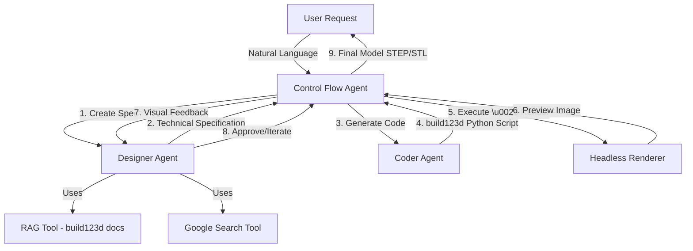

# Architecture - Backend (Forma AI Service)

## Executive Summary

The Backend is a **FastAPI-based multi-agent AI service** that orchestrates the generation of 3D CAD models from natural language using Google's Gemini AI. It implements a control flow architecture where specialized agents (Designer, Coder, Renderer) collaborate iteratively to produce engineering-grade geometry using the build123d CAD library.

## Technology Stack

| Category | Technology | Version | Purpose |
|----------|-----------|---------|---------|
| **Framework** | FastAPI | 0.118.3 | REST API server |
| **ASGI Server** | Uvicorn | 0.38.0 | Production web server |
| **CAD Library** | build123d | 0.10.0 | Parametric 3D modeling |
| **AI Platform** | Google Gemini | via google-genai 1.52.0 | LLM for agents |
| **AI Gateway** | LiteLLM | 1.80.7 | Multi-provider LLM interface |
| **Vector DB** | ChromaDB | 1.3.5 | RAG system for docs |
| **Embeddings** | Sentence Transformers | 5.1.2 | Text embeddings for RAG |
| **3D Rendering** | PyVista | 0.46.4 | Headless visualization |
| **3D Rendering** | VTK | 9.3.1 | Visualization toolkit |
| **Browser Automation** | Playwright | 1.56.0 | Web scraping for search |
| **Search** | DuckDuckGo Search | 8.1.1 | Reference image retrieval |
| **Environment** | Python dotenv | 1.2.1 | Configuration management |

## Architecture Pattern

**Multi-Agent Control Flow with RAG-Enhanced Generation**

The system uses a control loop pattern where a central orchestrator delegates to specialized agents:



### Control Flow Loop

1. **Specification Phase**: Designer agent analyzes user request, consults RAG system and Google Search to create detailed technical specifications
2. **Code Generation Phase**: Coder agent translates specification into executable build123d Python code
3. **Rendering Phase**: Headless renderer executes code, generates STEP/STL files, creates 2D preview images
4. **Feedback Phase**: Designer agent reviews preview against spec, provides feedback
5. **Iteration**: Loop repeats until model is approved or max iterations reached

## System Components

### Entry Point: `main.py`

- Initializes FastAPI application
- Configures CORS middleware (allow all origins)
- Mounts `/download` static file route for model downloads
- Includes A2A protocol router (`/v1/message:send`, `/v1/tasks/{taskId}`)
- Startup lifespan: Initializes RAG system, ingests build123d documentation

### Configuration: `config.py`

- `OUTPUT_DIR`: Directory for generated STEP/STL files (default: `outputs/`)
- `RAG_PERSIST_DIRECTORY`: ChromaDB persistence location (default: `rag_db/`)
- `MODEL_NAME`: Sentence transformer model (`all-mpnet-base-v2`)
- `BUILD123D_DOCS_URLS`: 24 documentation URLs from build123d.readthedocs.io

### A2A Protocol Layer (`a2a/`)

**Purpose**: Implements Agent-to-Agent protocol for async task management

- `a2a/api.py`: FastAPI router with `/v1/message:send` (POST), `/v1/tasks/{taskId}` (GET)
- `a2a/models.py`: Pydantic models for Task, Message, TaskState, Artifact
- `a2a/task_manager.py`: In-memory task storage, lifecycle management

**Task States**: SUBMITTED → WORKING → COMPLETED/FAILED/CANCELLED

### Multi-Agent System (`sub_agents/`)

#### 1. Control Flow Agent (`sub_agents/control_flow/`)
- Orchestrates the entire workflow
- Manages agent execution sequence
- Handles iteration and retry logic
- Maintains conversation context

#### 2. Designer Agent (`sub_agents/designer/`)
- **Role**: Product designer and reviewer
- **Capabilities**:
  - Natural language understanding of CAD requirements
  - RAG queries for build123d syntax and patterns
  - Google Search for reference images/concepts
  - Visual feedback on rendered models
- **Tools**: RAGTool, SearchTool

#### 3. Coder Agent (`sub_agents/coder/`)
- **Role**: CAD software engineer
- **Capabilities**:
  - Translates technical specs to build123d Python code
  - Applies geometric and parametric programming patterns
  - Error handling and debugging
- **Tools**: CADTools (code execution sandbox)

### Tool System (`tools/`)

#### `cad_tools.py` - CAD Code Execution
- Provides sandboxed environment for running build123d scripts
- Executes generated Python code
- Exports models to STEP/STL formats
- Error capture and reporting

#### `rag_tool.py` - Documentation Retrieval
- **Vector Database**: ChromaDB with `all-mpnet-base-v2` embeddings
- **Ingestion**: Playwright-based web scraping of build123d docs
- **Retrieval**: Semantic search for relevant documentation chunks
- **Persistence**: Incrementalupdate detection (avoids re-ingesting on startup)

#### `renderer.py` - Headless 3D Rendering
- Uses PyVista with EGL (Linux) or OSMesa (headless) backend
- Renders STEP/STL files to PNG preview images
- Configurable camera angles, lighting

#### `search_tools.py` - Web Search
- DuckDuckGo Search integration
- BeautifulSoup for HTML parsing
- Retrieves reference images and concept links

#### `security.py` - Code Sandboxing
- Validates generated Python code before execution
- Restricts dangerous imports and operations
- Timeout enforcement

## Data Architecture

### Task State Management

**Storage**: In-memory dictionary (not persistent across restarts)

```python
Task {
  id: UUID,
  contextId: UUID,
  status: {
    state: TaskState,
    message: Message,
    timestamp: datetime
  },
  history: [Message],
  artifacts: {
    parts: [FilePart(fileWithUri="/download/model.step")]
  }
}
```

### RAG Database Schema

**Vector Store**: ChromaDB collection with per-URL document chunks

- **Documents**: Chunked HTML from build123d documentation pages
- **Metadata**: Source URL, chunk index
- **Embeddings**: 768-dim vectors from `all-mpnet-base-v2`

## Deployment Architecture

### Docker Configuration

- **Dockerfile**: Multi-stage build with PyTorch, VTK, Playwright browsers
- **Image Size**: ~3-5GB (includes ML models and rendering dependencies)
- **Base Image**: Python 3.x with EGL support
- **Exposed Port**: 8001 (configurable via `docker-compose.yml`)

### Environment Variables

| Variable | Description | Required |
|----------|-------------|----------|
| `GOOGLE_API_KEY` | Google Gemini API key | Yes |
| `OUTPUT_DIR` | Model output directory | No (default: `outputs/`) |
| `RAG_PERSIST_DIRECTORY` | ChromaDB storage path | No (default: `rag_db/`) |

### API Endpoints

- **POST `/v1/message:send`**: Submit new task with prompt
- **GET `/v1/tasks/{taskId}`**: Poll task status
- **GET `/download/{filename}`**: Download generated STEP/STL files

## Development Workflow

### Running Locally

```bash
cd Backend
python -m venv venv
source venv/bin/activate
pip install -r requirements.txt
uvicorn main:app --reload --port 8001
```

### Running with Docker

```bash
docker compose up --build
```

### Testing

Tests located in `tests/`:
- `test_a2a_api.py`: A2A protocol endpoint tests
- `test_control_flow_agent.py`: Agent orchestration tests
- `test_cad_tools.py`: build123d execution tests
- `test_security.py`: Code sandboxing validation

## Security Considerations

⚠️ **Warning**: This is a proof-of-concept system with known security limitations:

- **Code Execution**: Runs AI-generated Python code without full isolation
- **Authentication**: No authentication or authorization implemented
- **Multi-Tenancy**: No user isolation (single shared task store)
- **CORS**: Allows all origins (`allow_origins=["*"]`)

**Recommendation**: Do not expose to untrusted users without implementing proper sandboxing, auth, and tenant isolation.
